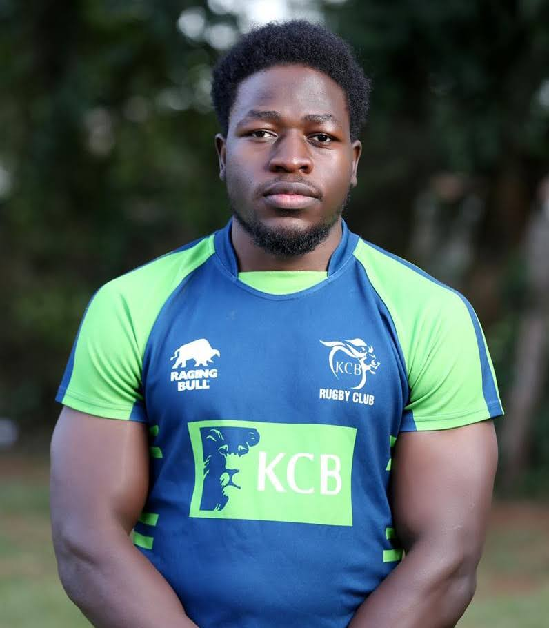

<link rel="stylesheet" href="styles.css" type="text/css">

##### Specialization: 
- 15s aside Rugby

##### Profile: 
- Height: 6'1
- Weight: 104 kgs

#### Primary Position 
- Back-Row

##### Secondary Position 
- Lock (4)

##### Participated Events at KCB Rugby Club
###### 2018/2019 Season: 
- Kenya Cup 
- Impala Floodlit Tournament
- Eric Shirley Shield Cup
- Enterprise Cup
- Mwamba Cup
- Nakuru 10s

###### 2017/2018 Season:
- Kenya Cup 
- Eric Shirley Shield Cup
- Enterprise Cup
- Mwamba Cup

##### Rugby Camp and Clinics Attended
- Rugby Skillset training at Nairobi, Karen Leadership Center (2018, 2019, and 2020).
- 3 weeks off-season training at Western Province/DHL Stormers Club at Cape Town, South Africa
(2018).

##### Top Career Achievements at KCB Rugby Club
- Won Eric Shirley Cup Back to Back (2017/2018 & 2018/2019 seasons).
- Won "Upcoming Player of the 2017/2018 season" category in Simba Rugby Awards.
- Won and defended Impala Floodlit Cup (2018).
